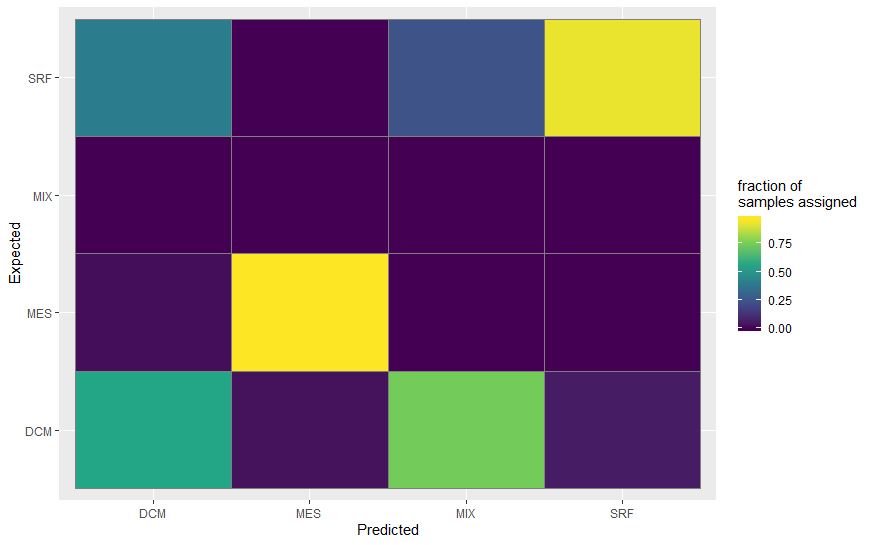

# Random Forest Classifier of Metabarcode Sequence Data

## Quick Start

  -Open the binder and press knit to run the code. 
  
## Example Output

   - 

## Summary
Random forest helps determine how well sequence variants group according to individual factors as determined by the metadata file. It     does this by employing an ensemble of uncorrelated decision tree models that eventually converge on the grouping. The heat map provides a visual representation of this grouping. Random forest does not indicate statistical differences among groups.

Inputs:
1.otu table
2.taxa table
3.mapping file
OR
1. phyloseq file

 
## Authors

 - Alia Al-Haj
        Github: https://github.com/aliaalhaj
        ORCID: https://orcid.org/0000-0003-1899-5117
 - Devon O'Rourke
        Github: https://github.com/devonorourke

## Links

Zenodo Binder, doi: LINK_TO_BINDER

Github Binder: 

Github Repository: https://github.com/speeding-up-science-workshops/<REPO_NAME>

